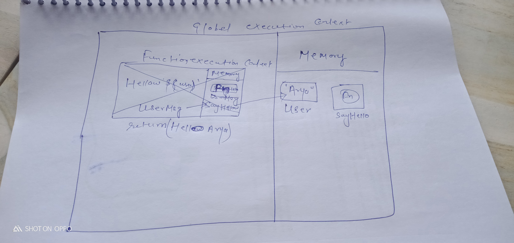

ans--- JavaScript is not that fancy, it does two things. One, it goes through our code, line by line. There's a block of code we're gonna work through right now. It goes through it line by line, and does each of the line of code, they call this the thread of execution.

2. Where the JavaScript code gets executed?
ans --- JavaScript can execute not only in the browser, but also on the server, or actually on any device that has a special program called the JavaScript engine. The browser has an embedded engine sometimes called a “JavaScript virtual machine”.


3. What does context means in Global Execution Context?
ans ---The global execution context is created when a JavaScript script first starts to run, and it represents the global scope in JavaScript. A function execution context is created whenever a function is called, representing the function's local scope.

4. When do you create a global execution context.
ans ---Execution context is a concept in the language spec that—in layman's terms—roughly equates to the 'environment' a function executes in; that is, variable scope (and the scope chain, variables in closures from outer scopes), function arguments, and the value of the this object.


5. Execution context consists of what all things?
ans ---It is the execution context that decides which code section has access to the functions, variables, and objects used in the code. During the execution ...


6. What are the different types of execution context?
ans--There are two kinds of Execution Context in JavaScript: Global Execution Context (GEC) Function Execution Context (FEC).


7. When global and function execution context gets created?
ans--The global execution context is created when a JavaScript script first starts to run, and it represents the global scope in JavaScript. A function execution context is created whenever a function is called, representing the function's local scope.22-Dec-2022


8. Function execution gets created during function execution or while declaring a function.
ans --- In conclusion, JavaScript execution context is a crucial part of understanding how JavaScript works behind the scenes. It determines the environment in which code is executed and what variables and functions are available to use.


9. Create a execution context diagram of the following code on your notebook. Take a 
screenshot/photo and store it in the folder named `img`. Use `` to display it here.


```js
var user = "Arya";

function sayHello(){
  return `Hello ${user}`;
}

var userMsg = sayHello(user);
```

<!-- Put your image here -->




```js
var marks = 400;
var total = 500;

function getPercentage(amount, totalAmount){
  return (amount * 100) / totalAmount;
}

var percentageMarks = getPercentage(marks, total);
var percentageProfit = getPercentage(400, 200);
```

<!-- Put your image here -->


```js
var age = 21;

function customeMessage(userAge){
  if(userAge > 18){
    return `You are an adult`;
  }else {
    return `You are a kid`;
  }
}

var whoAmI = customeMessage(age);
var whoAmIAgain = customeMessage(12);
```

<!-- Put your image here -->

